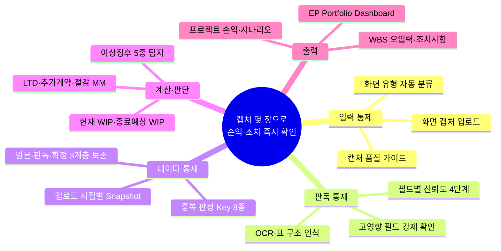
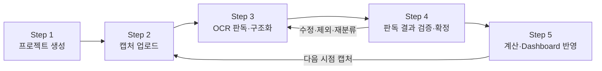
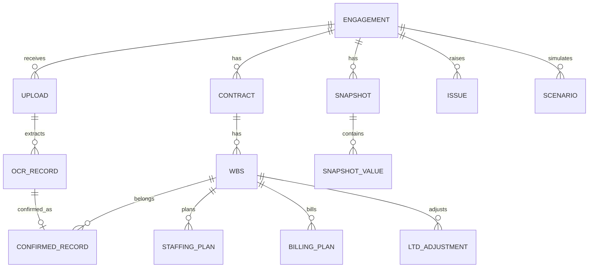

# 프로젝트 손익관리 프로그램 PRD

**캡처 몇 장으로 담당 프로젝트 전체의 손익과 필요 조치를 즉시 확인함 — OCR은 임시값, 확정은 사람, 저장은 Snapshot**

---

## 0. 전체 구조



---

## 1. 배경과 목표

### 1.1 문제 정의
- 사내 손익 시스템(Interlock, SWIFT WIP, Billing, Backlog, Expense·OS)이 프로젝트·WBS·기간·항목 단위로 분산되어 있어 EP가 담당 프로젝트 전체의 종료 시점 손익을 한 화면에서 판단하지 못함
- 시스템 데이터 파일 Export가 제한되어 화면 조회 후 수기로 취합·계산하는 구조임
- 계약기간 이후 발생액의 WBS 오귀속, 동일 화면 중복 집계, 단위(원·천원·백만원) 혼동, 합계 불일치가 손익 판단 오류의 주원인임

### 1.2 목표
- 입력을 파일 Import가 아닌 **화면 캡처 업로드**로 단순화함
- OCR 판독값을 자동 확정하지 않고 **사용자 검증을 통과한 값만** 손익 계산에 사용함
- 업로드 시점별 **Snapshot**을 누적하여 기간별 증감과 조치 효과를 추적함
- 현재 WIP, 종료예상 WIP, LTD 필요액, 추가계약 필요액, 절감 필요 MM을 프로젝트별로 산출함

### 1.3 성공 기준

| 지표 | 목표 | 측정 방법 |
|---|---|---|
| 손익 확인 소요 시간 | 캡처 업로드 후 10분 이내 확정·대시보드 반영 | 업로드 시각 대비 확정 시각 |
| 고영향 필드 판독 정확도 | 검증 화면에서 수정 없이 확인되는 비율 90% 이상 | 확인 건수 / 전체 건수 |
| 중복 집계 | 확정 데이터 기준 0건 | 중복 판정 Key 충돌 건수 |
| 산술 불일치 미탐지 | 0건 | 화면 합계 대비 산식 결과 검증 로그 |

---

## 2. 사용자와 범위

### 2.1 사용자
- **Primary**: EP(Engagement Partner) — 담당 프로젝트 포트폴리오의 손익·조치 판단
- **Secondary**: EM(Engagement Manager) — 캡처 업로드·검증 실무 위임 가능

### 2.2 범위

| 구분 | 포함 | 제외 |
|---|---|---|
| 입력 | 화면 캡처 이미지(PNG·JPG), 프로젝트 마스터 수기 입력 | 사내 시스템 API·DB 직접 연계, 파일(Excel·CSV) Import |
| 처리 | OCR·표 구조 인식, 검증·확정, Snapshot, 손익 계산, 이상징후 탐지 | 사내 시스템으로의 역방향 반영(Write-back) |
| 출력 | 대시보드, 프로젝트 손익 상세, 시나리오, 조치사항 | 공식 회계 보고서 생성, 승인 워크플로 |
| 사용자 | 단일 EP 계정(초기), EM 위임(2단계) | 전사 다중 조직 권한 체계 |

---

## 3. 도메인 용어와 산식

### 3.1 용어

| 용어 | 정의 | 데이터 출처 화면 |
|---|---|---|
| Engagement | 고객사·계약 단위 프로젝트, Engagement Code로 식별 | 계약 화면 |
| 계약변경 차수 | 최초 계약(0차)과 변경계약(1차, 2차…)을 구분하는 순번, 차수별 금액·유효기간·WBS 보유 | 계약 화면 |
| WBS Code | 비용 귀속 단위 코드(예: KOR01434-01-01-01-1000), 계약 차수에 종속 | 전 화면 공통 |
| Time | 인력 투입 시간의 금액 환산액(MM 또는 시간 × 적용 Rate) | WIP·Time 화면 |
| Expense | 경비 발생액 | Expense 화면 |
| OS | Outside Service, 외주·용역비 | Expense·OS 화면 |
| Billing | 청구 예정·완료액 | Billing 화면 |
| WIP | 미청구 발생액, Time + Expense − Billing | SWIFT WIP 화면 |
| LTD | 청구 불가 WIP를 조정(상각)하는 금액, 계약금액 초과분이 주원인 | WIP·LTD Adjustment 화면 |
| Provision | 손실 충당액 | WIP 화면 |
| Backlog | 잔여 투입 계획(인력·직급·월별 투입률·잔여 MM) | Backlog·Staffing 화면 |
| Net Revenue | 순매출 | WIP 화면 |

- WIP 정의는 화면별로 표시 기준이 다를 수 있으므로 **화면의 실제 항목명(raw_label)을 값과 함께 저장**하고 산식 결과와 불일치 시 경고함
- 누적값(Cumulative)과 월 발생액(Monthly)은 **서로 다른 값 기준(value_basis)으로 저장**하며 혼합 합산을 금지함

### 3.2 산식

| 구분 | 산식 | 비고 |
|---|---|---|
| 화면 합계 검증 | Time + Expense + OS = 화면 합계 | 불일치 시 자동 확정 보류 |
| 현재 WIP | Time + Expense − Billing | 화면 WIP 값과 비교, 불일치 시 경고 |
| 계약 대비 잔액 | 총 계약금액 − 누적 사용액 | 총 계약금액 = 차수별 계약금액 합 |
| 잔여 투입 예상액 | Σ(잔여 MM × 적용 Rate) + 예상 Expense·OS | Backlog 화면 기반 |
| 종료예상 사용액(EAC) | 누적 사용액 + 잔여 투입 예상액 | |
| 최종 예상 잔액 | 총 계약금액 − 종료예상 사용액 | 음수이면 손실 예상 |
| 종료예상 WIP | 종료예상 사용액 − 총 Billing 예정액 | |
| LTD 필요액 | max(0, 종료예상 사용액 − 총 계약금액) | 추가계약으로 회수하지 않을 경우 |
| 추가계약 필요액 | 초과분 중 변경계약으로 회수할 금액 | 시나리오 변수 |
| 절감 필요 MM | 초과분 ÷ 잔여 인력 가중평균 Rate | 추가계약 없이 손익 방어 시 |
| 예상 손익률 | 최종 예상 잔액 ÷ 총 계약금액 | |

- 계산이 화면 표시값과 맞지 않으면 자동 확정하지 않고 경고함
- 계산 단위 계층: Engagement → 계약변경 차수 → WBS → 기간 → 항목

---

## 4. 사용자 흐름



| Step | 사용자 행위 | 시스템 행위 | 결과 데이터 |
|---|---|---|---|
| 1. 프로젝트 생성 | 프로젝트명·고객사·Engagement Code·계약기간·계약유형·EP·EM·최초 계약금액·변경계약 금액·계약별 유효기간·계약별 WBS Code 입력(최초 1회) | 마스터 저장, WBS별 유효기간 등록 | Engagement, Contract, WBS |
| 2. 캡처 업로드 | 여러 장 동시 Drag & Drop, 화면 유형 선택 또는 자동 분류 위임 | 이미지 해시 생성, 화면 유형 분류(계약정보·Time·Expense·Billing·WIP·Staffing·Backlog·LTD Adjustment·기타), 동일 해시 재업로드 차단 | Upload |
| 3. OCR 판독·구조화 | 없음(자동) | 표 구조 인식, 행 단위 분리, 필드 추출(WBS Code·조회 기준일·조회 기간·계약금액·Time·Expense·Billing·Net Revenue·WIP·LTD·구성원 또는 직급·MM·시간·적용 Rate·프로젝트 시작일·종료일), 단위 인식, 필드별 신뢰도 부여, 산술 교차검증, 이전 Snapshot 비교, 중복 판정 | OcrRecord(임시) |
| 4. 검증·확정 | 값별로 확인·수정·제외·다른 WBS로 재분류·중복 표시·판독 실패 표시 | 수정 셀 색상 표시, 수정자·시점 기록, 고영향 필드 미확인 시 확정 차단 | ConfirmedRecord(확정) |
| 5. 계산·반영 | 대시보드·손익 상세·시나리오 조회 | 확정값만으로 Snapshot 생성, 산식 계산, 이상징후·조치사항 생성 | Snapshot, Issue |

---

## 5. 기능 요구사항

### FR-01 프로젝트 마스터 관리
- Engagement 생성·수정, 계약 차수 추가(금액·유효기간), 차수별 WBS Code 등록
- WBS Code는 계약 차수의 유효기간을 상속하며, 유효기간 밖 발생액은 이상징후 대상임
- 계약유형(고정가·T&M 등)에 따라 LTD·추가계약 계산 로직 분기 가능하도록 속성 보유

### FR-02 캡처 업로드
- 다중 파일 Drag & Drop, PNG·JPG·클립보드 붙여넣기 지원
- 이미지 SHA-256 해시 저장, 동일 해시 재업로드 시 기존 Upload로 연결하고 경고
- 화면 유형: 사용자 선택 우선, 미선택 시 자동 분류 후 사용자 확인
- 업로드 단위로 상태 관리: uploaded → ocr_done → verifying → confirmed → excluded

### FR-03 OCR·표 구조 인식
- 표 제목·열 제목·합계 행·조회 기준일·조회 기간·필터 조건을 함께 추출
- 하나의 화면에 여러 WBS 행이 있으면 **행 단위 레코드로 분리**하되 동일 Upload에서 추출됐다는 관계 유지
- 금액 단위(원·천원·백만원) 인식, 단위 미표시 시 신뢰도 Low 부여
- 숫자 잘림·커서·팝업 가림 감지 시 신뢰도 Low 또는 Failed 부여
- 출력은 정의된 JSON 스키마(§6.3)로 고정하며 자유 텍스트 반환 금지

### FR-04 필드별 신뢰도 표시

| 등급 | 조건 | 확정 규칙 |
|---|---|---|
| High | 명확하게 판독되고 산술검증 통과 | 일반 필드는 일괄 확인 가능 |
| Medium | 판독 가능하나 다른 화면·이전 Snapshot과 불일치 | 개별 확인 필수 |
| Low | 숫자 잘림 또는 단위 불명확 | 수정 또는 제외 필수 |
| Failed | 판독 불가 | 직접 입력 필수 |

- 고영향 필드(계약금액·Time·Expense·Billing·LTD·날짜·금액 단위·WBS Code)는 High여도 **개별 사용자 확인**을 요구함

### FR-05 검증·확정 화면
- 좌측 원본 캡처(추출 영역 하이라이트), 우측 판독 표, 하단 산술검증·이전 Snapshot 비교
- 값별 액션 6종: 확인·수정·제외·다른 WBS로 재분류·중복 표시·판독 실패 표시
- 수정 셀은 색상으로 구분하고 원본 판독값을 함께 표시
- 고영향 필드 미확인 또는 Failed 잔존 시 최종 확정 버튼 비활성화
- 확정은 Upload 단위로 수행하며 부분 확정(일부 행 제외)을 허용함

### FR-06 산술 교차검증
- 화면 합계 검증(Time + Expense + OS), WIP 산식 검증, 계약 잔액 검증을 확정 전 자동 실행
- 불일치 시 해당 필드를 Medium으로 강등하고 차이 금액을 표시함
- 검증 결과는 Upload별 로그로 보존함

### FR-07 중복 판정
- 판정 Key 8종: WBS Code, 조회 기준일, 조회 시작일·종료일, 항목 유형, 금액, 화면 제목, 이미지 해시

| 상황 | 판정 | 처리 |
|---|---|---|
| Key 전체 동일 | 자동 중복 후보 | 기본 제외, 사용자 해제 가능 |
| 동일 WBS·동일 기간·금액 상이 | 최신 Snapshot 후보 | 이전 값 대체 여부 사용자 선택 |
| 동일 WBS·상이한 기간 | 별도 Snapshot | 자동 등록 |
| 누적값과 월 발생액 혼재 | 유형 분리 | value_basis 구분 저장, 합산 금지 |
| 수정 전·후 화면 | 변경 Snapshot | 전·후 레코드를 change_link로 연결 |

### FR-08 Snapshot 관리
- 확정 시점마다 Engagement·WBS·항목별 값을 Snapshot으로 보존하며 기존 값을 덮어쓰지 않음
- 연속 Snapshot 간 비교 항목: Time 증가액, Expense 증가액, Billing 증가액, WIP 증가액, Backlog 변경액, 종료예상 손익 변화, LTD 조정 후 WIP 재발생 여부
- 특정 Snapshot 기준으로 대시보드를 재현할 수 있어야 함(시점 조회)

### FR-09 이상징후 탐지

| 유형 | 탐지 조건 | 제안 조치 |
|---|---|---|
| 기간 오류 | 조회 기간이 계약기간·WBS 유효기간 밖 | 확인·제외 |
| WBS 귀속 오류 | 1차 WBS 유효기간 이후 발생액이 1차 WBS에 귀속 | 1차 WBS 유지·2차 WBS로 재분류·중복 입력 여부 확인·계산 대상에서 임시 제외 |
| 중복 | FR-07 판정 | 제외·유지 |
| 단위 오류 | 동일 WBS 항목 간 자릿수 급변, 단위 미표시 | 단위 수정 |
| 합계 불일치 | FR-06 검증 실패 | 원본 재확인·수정 |

- 재분류 선택 시 관련 WBS의 예상 LTD·계약 잔액을 즉시 재계산하여 전·후 값을 나란히 표시함

### FR-10 손익 계산
- §3.2 산식을 확정값만으로 계산, OCR 임시값은 계산에서 배제
- 계산 결과는 파생 데이터로 분류하고 계산 시점의 Snapshot ID·산식 버전을 함께 저장함
- Backlog 미입력 시 잔여 투입 예상액을 0으로 두지 않고 "미입력"으로 표시하여 종료예상값을 잠정 처리함

### FR-11 시나리오 계산기
- Base·Best·Worst 3개 시나리오를 프로젝트별로 저장
- 변수: 잔여 MM 증감률, 적용 Rate, 종료일 연장 개월, 추가계약 성사 금액, 예상 Expense·OS
- 시나리오별 종료예상 WIP·LTD 필요액·추가계약 필요액·절감 필요 MM·예상 손익률을 동시 표시

### FR-12 대시보드·조치사항
- EP Portfolio Dashboard 항목: 화면 캡처 업로드, 미확인 OCR 건수, 판독 오류 건수, 중복 의심 건수, WBS 귀속 검토 건수, 최신 Snapshot 기준일, 프로젝트별 최종 예상손익, 조치 필요 프로젝트
- 프로젝트 손익 화면 항목: 계약금액, 누적 실적, 잔여투입, 종료예상액, LTD 필요액, WBS 오류 후보, Billing 현황, 시나리오 계산기
- 조치사항 생성 규칙: LTD 필요액 > 0, 미청구액 > 기준치, Backlog 미입력, 이상징후 미해결 시 Billing 및 WIP 조치사항으로 자동 등록

---

## 6. 데이터 모델

### 6.1 데이터 3계층

| 계층 | 성격 | 저장 규칙 |
|---|---|---|
| OCR 판독값 | 임시 데이터 | 원본 이미지·최초 판독값 불변 보존 |
| 사용자 확인값 | 확정 데이터 | 수정자·수정 시점 기록, 손익 계산의 유일한 입력 |
| 시스템 계산값 | 파생 데이터 | Snapshot ID·산식 버전과 함께 저장, 재계산 가능 |

### 6.2 엔티티



| 엔티티 | 핵심 속성 |
|---|---|
| ENGAGEMENT | id, name, client, engagement_code, contract_type, ep, em, start_date, end_date, currency |
| CONTRACT | id, engagement_id, seq(0=최초), amount, valid_from, valid_to |
| WBS | id, contract_id, code, name, valid_from, valid_to |
| UPLOAD | id, engagement_id, file_path, image_hash, screen_type, screen_title, as_of_date, uploaded_by, uploaded_at, status |
| OCR_RECORD | id, upload_id, row_index, wbs_code_raw, wbs_id, as_of_date, period_from, period_to, item_type, raw_label, amount_raw, amount, unit, value_basis, confidence, bbox, arithmetic_check |
| CONFIRMED_RECORD | id, ocr_record_id, wbs_id, item_type, amount, unit, period_from, period_to, value_basis, action, confirmed_by, confirmed_at, note, change_link_id |
| SNAPSHOT | id, engagement_id, as_of_date, created_at, upload_ids, formula_version |
| SNAPSHOT_VALUE | snapshot_id, wbs_id, item_type, amount, value_basis |
| STAFFING_PLAN | id, wbs_id, person_or_grade, month, fte_rate, remaining_mm, rate, expected_time |
| BILLING_PLAN | id, wbs_id, planned_amount, billed_amount, billing_date, unbilled_amount, billable_expense |
| LTD_ADJUSTMENT | id, wbs_id, adjust_date, amount, note |
| ISSUE | id, engagement_id, type, severity, related_record_ids, suggested_actions, selected_action, status, resolved_at |
| SCENARIO | id, engagement_id, kind(base·best·worst), params(json), result(json), computed_at |
| AUDIT_LOG | id, entity, entity_id, field, before, after, actor, at |

- item_type 열거값: contract_amount, time, expense, os, billing, net_revenue, wip, ltd, provision, backlog_mm, rate
- value_basis 열거값: cumulative, monthly, period
- action 열거값: confirm, edit, exclude, reassign, duplicate, failed

### 6.3 OCR 출력 JSON 스키마

```json
{
  "upload_id": "IMG-20260917-001",
  "screen_type": "wip",
  "screen_title": "Work In Progress",
  "as_of_date": "2026-09-15",
  "period": { "from": "2025-11-01", "to": "2025-12-31" },
  "unit": "KRW",
  "rows": [
    {
      "row_index": 1,
      "wbs_code": { "value": "KOR01434-01-01-01-1000", "confidence": "high" },
      "fields": [
        { "item_type": "time", "raw_label": "Time", "amount": 263746000, "confidence": "high" },
        { "item_type": "expense", "raw_label": "Expense", "amount": 6216247, "confidence": "high" }
      ]
    }
  ],
  "totals": [ { "raw_label": "Total", "amount": 269962247 } ],
  "arithmetic_checks": [ { "rule": "time+expense=total", "passed": true, "diff": 0 } ]
}
```

---

## 7. 화면 설계

| 화면 | 구성 | 핵심 동작 |
|---|---|---|
| Dashboard | 상단 업로드 영역, 좌측 처리 대기 카운터(미확인 OCR·판독 오류·중복 의심·WBS 귀속 검토), 우측 프로젝트별 최종 예상손익 표, 하단 조치 필요 프로젝트 | 카운터 클릭 시 해당 검증 대기열로 이동 |
| OCR 검증 | 좌 원본 캡처, 우 판독 표, 하단 산술검증·이전 Snapshot 비교, 최종 확정 버튼 | 셀 단위 액션 6종, 수정 셀 색상 표시, 고영향 필드 미확인 시 확정 차단 |
| 프로젝트 손익 | 계약금액·누적 실적·잔여투입·종료예상액·LTD 필요액 요약, WBS별 상세 표, Billing 현황, WBS 오류 후보 | Snapshot 시점 전환, 시나리오 계산기 호출 |
| 시나리오 계산기 | Base·Best·Worst 변수 입력 폼, 결과 비교 표 | 변수 변경 즉시 재계산, 시나리오 저장 |
| 프로젝트 마스터 | Engagement·계약 차수·WBS 등록 폼 | 유효기간 겹침 검사 |

---

## 8. 기술 아키텍처

### 8.1 권장 스택

| 계층 | 선택 | 근거 |
|---|---|---|
| 프런트엔드 | React + Vite + TypeScript | 이미지 좌우 비교·셀 편집 UI에 컴포넌트 재사용 유리 |
| 백엔드 | Python FastAPI | OCR 후처리·수치 계산·pandas 활용, 단일 프로세스 배포 |
| DB | SQLite(초기) → PostgreSQL(다중 사용자 전환 시) | 단일 사용자 로컬 실행에 설치 부담 없음 |
| OCR·표 인식 | 멀티모달 LLM(Claude Vision) + JSON 스키마 강제 출력, 산술검증 후처리 | 표 구조·한글 항목명·단위 인식에서 전통 OCR 대비 우위 |
| 대체 OCR | PaddleOCR + 표 구조 인식(PP-Structure) | 외부 전송 불가 환경용, 검증 부담 증가 전제 |
| 배포 | 로컬 실행(localhost), 이미지·DB 로컬 디스크 저장 | 사내 손익 데이터 외부 유출 최소화 |

### 8.2 데이터 보호
- 원본 캡처·DB는 로컬 암호화 볼륨에 저장
- 외부 LLM API 사용 시 캡처 이미지가 외부로 전송되므로 **사내 정보보호 정책 확인이 선행 결정 사항**임(§10)
- API 사용 시 WBS Code·고객사명 마스킹 옵션 제공

### 8.3 폴더 구조(제안)

```
pnl-manager/
├── backend/
│   ├── app/
│   │   ├── models/        # SQLAlchemy 엔티티(§6.2)
│   │   ├── ocr/           # 판독·스키마 검증·신뢰도 부여
│   │   ├── rules/         # 산술검증·중복 판정·이상징후
│   │   ├── calc/          # 손익 산식(§3.2), 시나리오
│   │   ├── api/           # FastAPI 라우터
│   │   └── main.py
│   └── tests/             # KOR01434 케이스 E2E
├── frontend/
│   └── src/
│       ├── pages/         # Dashboard, Verify, ProjectPnl, Scenario, Master
│       └── components/    # ImageViewer, EditableTable, SnapshotDiff
├── data/                  # uploads/, db.sqlite (gitignore)
└── docs/PRD.md
```

---

## 9. 비기능 요구사항

| 항목 | 요구 |
|---|---|
| 처리 시간 | 캡처 1장 OCR·구조화 30초 이내, 검증 화면 로딩 2초 이내 |
| 감사 추적 | 모든 확정·수정·제외·재분류에 수정자·시점·전후 값 기록 |
| 재현성 | 임의 Snapshot 시점의 대시보드·계산 결과 재현 가능 |
| 정확성 | 산식 결과와 화면 표시값 불일치 시 자동 확정 금지 |
| 단위 일관성 | 저장은 원(KRW) 정수 단위로 통일, 표시 시 단위 변환 |
| 가용성 | 오프라인(외부 API 불가) 상태에서도 업로드·직접 입력·계산 가능 |

---

## 10. 사전 결정 사항

| 항목 | 선택지 | 영향 |
|---|---|---|
| OCR 엔진 | Claude Vision API / 로컬 PaddleOCR | 판독 정확도, 정보보호 정책 적합성 |
| WIP 정의 | 화면 표시값 우선 / 산식 계산값 우선 | 불일치 시 경고 기준 |
| 적용 Rate 기준 | 표준 Rate / 실적 평균 Rate / Backlog 화면 Rate | 잔여 투입 예상액 정확도 |
| LTD 정의 | 계약금액 초과분 상각 / 사내 정의 별도 확인 | LTD 필요액 산식 |
| 통화 | KRW 단일 / 다중 통화 | 데이터 모델 currency 처리 |
| 사용자 | EP 단일 / EP + EM 위임 | 인증·권한 범위 |
| 배포 | 로컬 데스크톱 / 사내 서버 | DB 선택, 접근 통제 |

---

## 11. 구현 단계

| Phase | 범위 | 완료 기준 |
|---|---|---|
| 0. 초기 검증(1주) | Python CLI: 캡처 업로드 → 표·숫자 추출 → 데이터 행 변환 → 사용자 오류 수정(CSV 편집) → 프로젝트·WBS별 누적 → 손익·LTD 계산 → HTML 리포트 출력 | 실제 캡처 20장 이상으로 고영향 필드 판독 정확도 측정, 산식 검산 통과 |
| 1. MVP(2~3주) | 웹 UI(업로드·검증·확정), DB, Snapshot, 프로젝트 마스터, 기본 대시보드 | KOR01434 E2E 시나리오(§12) 통과 |
| 2. 통제 강화(2주) | 중복 판정, 이상징후 5종, WBS 귀속 재분류·재계산, 시나리오 계산기, 조치사항 | 이상징후 각 유형 테스트 케이스 통과 |
| 3. 포트폴리오(2주) | 다중 프로젝트 대시보드, Backlog·Billing 연계 계산, Snapshot 시점 조회, EM 위임 권한 | EP 포트폴리오 전체 손익 10분 이내 확인 |

---

## 12. 수용 기준 — KOR01434 E2E 시나리오

### 12.1 입력
- 1차 WBS 캡처: 2025년 5~10월 Time·Expense, 2025년 11~12월 Time·Expense
- 2차 WBS 캡처: 2025년 11~12월 Time·Expense, LTD 조정액, 추가 계약금액

### 12.2 기대 동작
1. 두 캡처를 동시 업로드하면 각각 wip 유형으로 자동 분류됨
2. 1차 WBS 캡처의 2025년 11~12월 행(Time 8,030,000원, Expense 1,865,867원, 합계 9,895,867원)이 1차 계약기간 이후 발생액으로 탐지되어 WBS 귀속 검토 Issue가 생성됨
3. Issue의 제안 조치 4종(1차 WBS 유지, 2차 WBS로 재분류, 중복 입력 여부 확인, 계산 대상에서 임시 제외)이 표시됨
4. 2차 WBS로 재분류 선택 시 다음 값이 즉시 재계산됨
   - 1차 WBS 예상 LTD: 31,962,247원
   - 2차 WBS 예상 LTD: 37,525,027원(기존 27,629,160원 + 추가 검토액 9,895,867원)
5. 검산: 27,629,160 + 9,895,867 = 37,525,027 일치
6. 재분류 전·후 Snapshot이 각각 보존되고 대시보드에 최신 Snapshot 기준일이 갱신됨
7. 동일 캡처를 재업로드하면 이미지 해시 일치로 중복 경고가 표시되고 자동 확정되지 않음

### 12.3 검증 화면 표시 예시

| 필드 | 판독값 | 상태 |
|---|---|---|
| WBS Code | KOR01434-01-01 | 확인 |
| 조회기간 | 2025-11 ~ 2025-12 | 확인 |
| Time | 8,030,000원 | 확인 필요(고영향) |
| Expense | 1,865,867원 | 확인 |
| 합계 | 9,895,867원 | 자동검증 통과 |

---

## 13. 캡처 품질 가이드(사용자 안내문)

| 권장 | 지양 |
|---|---|
| 전체 브라우저 화면보다 표 영역 중심으로 캡처 | 숫자가 잘린 화면 |
| 표 제목·조회 기준일·조회 기간·필터 조건 포함 | 표 제목이 없는 일부 행만 캡처 |
| WBS Code 열이 잘리지 않도록 캡처 | 합계와 세부행이 다른 화면에 있으나 연결 표시가 없는 경우 |
| 열 제목·합계 행 포함 | 동일 화면 다중 업로드 |
| 금액 단위(원·천원·백만원) 표시 포함 | 단위 미표시 캡처 |
| 가로 스크롤 표는 여러 장으로 나누되 WBS Code 열 중복 포함 | 여러 프로젝트 혼재이나 프로젝트명 없는 화면 |
| 확대율 일정 유지, 커서·팝업이 숫자를 가리지 않게 처리 | |
